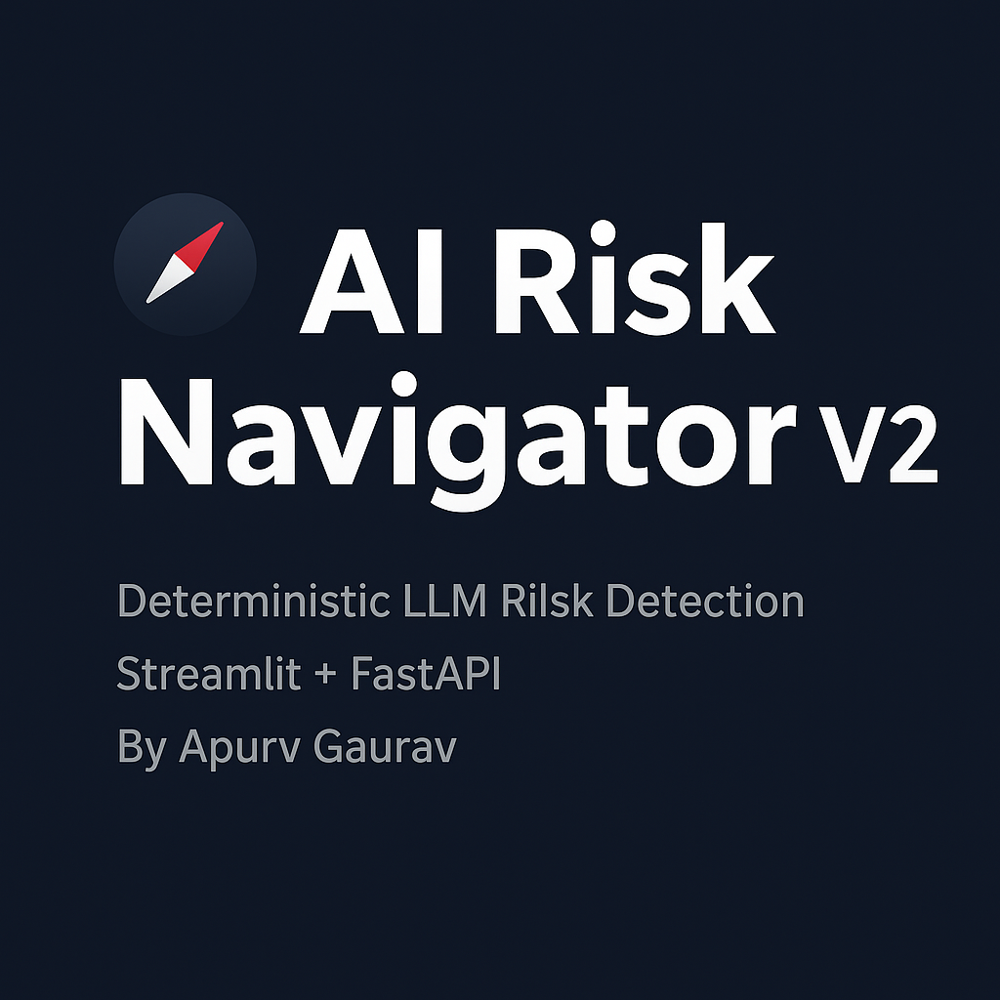

# 🧭 AI Risk Navigator V2
**Deterministic Framework for Real-Time LLM Risk Detection and Triage**



<p align="center">
  
  
  
  
  
</p>

---

## 📘 At a Glance
| Category | Description |
|-----------|-------------|
| **Purpose** | Detect and triage hallucination, bias, latency, and safety risks in LLM outputs |
| **Design Type** | Deterministic, rule-based, non-ML engine |
| **Deployment** | Streamlit UI + FastAPI Backend |
| **Privacy Mode** | 100 % Offline Processing (no cloud dependency) |
| **Patent Link** | *19/275,864 – AI Risk Navigator V2 (Formatting Refile in Progress)* |

---

## 🧩 System Architecture


**Core Concept:**  
AI Risk Navigator V2 is a model-agnostic, privacy-preserving triage system that identifies, tags, and ranks risks in LLM responses using **deterministic rule logic** rather than probabilistic models.  
It enables on-device real-time monitoring of hallucination, bias, latency anomalies, and safety violations with zero data leakage.

---

## ⚙️ Features
- ✅ **Deterministic Rule Engine** – Reproducible triage decisions, no ML uncertainty  
- 🧠 **Model-Agnostic Design** – Integrates with any LLM API or local model  
- 🔒 **Offline Privacy Mode** – All processing runs locally on-device  
- ⚡ **Latency Profiler** – Tracks response timing and flags slow outputs  
- 🧾 **Bias & Hallucination Detection** – Regex + keyword logic for verifiable tagging  
- 📊 **Streamlit Dashboard** – Interactive triage visualization + JSON log export  
- 🧱 **FastAPI Backend** – Modular API for enterprise integration  

---

## 🧠 Example Workflow
1. User query is sent to the FastAPI backend.  
2. LLM response is analyzed by the Deterministic Rule Engine.  
3. Rules assign risk tags (e.g., `hallucination`, `bias`, `latency`).  
4. Results are ranked and displayed in the Streamlit dashboard.  
5. A JSON log is exported for auditing or compliance review.

---

## 📂 Repository Structure
```text
AI-Risk-Navigator-V2/
│
├── app/                  # Streamlit Frontend
├── backend/              # FastAPI API + Rule Engine
├── assets/               # Banner + Architecture Images
├── rules/                # JSON Rule Definitions
├── logs/                 # Sample Triage Logs
├── requirements.txt
└── README.md

Quick Start

1. Clone and Install

git clone https://github.com/apurvgaurav/AI-Risk-Navigator-V2.git
cd AI-Risk-Navigator-V2
pip install -r requirements.txt


2. Run FastAPI Backend

cd backend
uvicorn main:app --reload


3. Launch Streamlit Dashboard

cd app
streamlit run dashboard.py


The UI runs at http://localhost:8501 and communicates with the FastAPI backend at http://localhost:8000.

🧮 Sample Rule (JSON)
{
  "rule_id": "HALLUCINATION_01",
  "pattern": "\\b(not verified|fictional|assumed)\\b",
  "risk_type": "hallucination",
  "severity": "high",
  "action": "flag"
}

📑 Research and Patent Context

Paper Title: AI Risk Navigator V2: Deterministic Framework for Real-Time Model Risk Detection and Triage

Conference/Journal Target: Frontiers in AI | IEEE Access (2025 submission pipeline)

Patent Application #: 19/275,864 – Formatting Refiling in Progress (Track One)

Author: Apurv Gaurav

🧠 Future Scope

GUI-based rule authoring and policy heatmap

Auto-tagging of hallucination and bias severity levels

Configurable risk profiles for enterprise use cases

JSON → CSV and PDF policy exports

Integration with PromptPilot and EdgeLLM projects

🧩 Related Projects
Project	Description
EdgeLLM V2	Offline LLM Architecture with Self-Forgetting Memory and On-Device Alignment Debugger
PromptPilot	Prompt Governance and Evaluation Framework
LLM Code Safety Auditor	Rule-Based Code Sanitization and Remediation Engine
📫 Contact

Author: Apurv Gaurav
Website: apurvgaurav.com

LinkedIn: linkedin.com/in/apurvgaurav

Confidential – Patent Use Only | © 2025 Apurv Gaurav


---

### ✅ Next Action
1. Create or verify `assets/banner.png` and `assets/architecture_diagram.png`.  
2. Replace the placeholder image paths if needed to match your repo structure.  
3. Commit with:
```bash
git add README.md
git commit -m "Finalize polished README for AI Risk Navigator V2"
git push