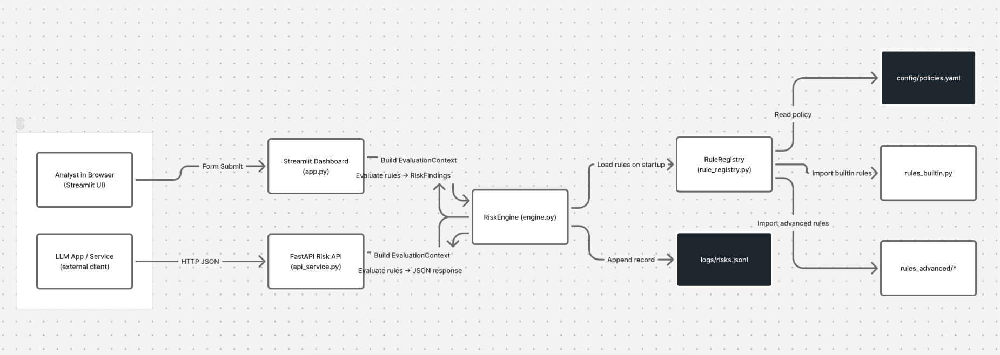

# 🧭 AI Risk Navigator V2

!


**AI Risk Navigator V2** is a **deterministic, policy-driven risk-detection framework for LLM systems.**  
It evaluates LLM prompts + responses for multiple classes of risk — **safety, bias, hallucination, latency, and PII leakage** — using a transparent rules engine instead of opaque ML classifiers.

The system is designed to be:

- **Model-agnostic:** works with any LLM (OpenAI, Anthropic, local models, etc.)
- **Deterministic & auditable:** pure functions + config, no hidden weights  
- **Policy-driven:** rules are loaded from YAML, not hard-coded  
- **Deployable:** available as both a **Streamlit analyst UI** and a **FastAPI microservice**

---

## ✨ Key Features

### 🧠 Rule-Based Engine (`risk_engine/`)
- Deterministic rules with structured `RiskFinding` outputs  
- Severity taxonomy (`critical`, `high`, `medium`, `low`)  
- Risk types: `safety`, `bias`, `hallucination`, `latency`, `pii`

### 📜 Policy-Driven Configuration (`config/policies.yaml`)
- Enable / disable rules without code changes  
- Configure thresholds (e.g., latency spike threshold)  
- Pluggable rule modules (built-in + advanced)

### 🧱 Built-In Rules

| ID | Category | Description |
|:--:|:--|:--|
| `LAT-001` | Latency | Latency spike detection |
| `SAFE-001` | Safety | Toxic keyword blocklist |
| `BIAS-001` | Bias | Biased phrase detector (“all X are Y”) |
| `HALL-001` | Hallucination | Naive factual consistency check (country capitals) |
| `PII-001` | Safety | PII pattern detector (emails, SSN, phone, card) |
| `INJ-001` | Safety | Prompt injection / jailbreak heuristic detector |

### 📊 Analyst Dashboard (`app.py`)
- Streamlit app for interactive testing of prompts + responses  
- Risk summary by severity and risk type  
- Detailed rule cards with metadata and snippets  
- **Screenshot Mode** for clean portfolio screens  
- **Download Logs** button (JSONL export of evaluations)

### 🔌 Microservice API (`api_service.py`)
- FastAPI service exposing:  
  - `GET /health` – engine status & rule count  
  - `POST /evaluate` – evaluate a prompt / response pair  
- JSON input / output, ready for integration with any LLM application

### 🕵️ Immutable Logging (`logs/risks.jsonl`)
- Every evaluation logged as a JSON line with context + findings  
- Suitable for offline analysis and compliance / audit trails

---

## 🧩 System Architecture

```mermaid
flowchart LR
  subgraph Clients
    A1[Analyst in Browser<br/>(Streamlit UI)]
    A2[LLM App / Service<br/>(external client)]
  end

  A1 -->|Form Submit| S[Streamlit Dashboard<br/>(app.py)]
  A2 -->|HTTP JSON| F[FastAPI Risk API<br/>(api_service.py)]

  S -->|Build EvaluationContext| E[RiskEngine<br/>(engine.py)]
  F -->|Build EvaluationContext| E

  E -->|Load rules on startup| RR[RuleRegistry<br/>(rule_registry.py)]
  RR -->|Read policy| C[config/policies.yaml]
  RR -->|Import builtin rules| RB[rules_builtin.py]
  RR -->|Import advanced rules| RA[rules_advanced/*]

  E -->|Evaluate rules → RiskFindings| S
  E -->|Evaluate rules → JSON response| F

  E -->|Append record| L[logs/risks.jsonl]

  classDef store fill:#1f2933,stroke:#ffffff,color:#ffffff;
  class C,L store;


ai-risk-navigator/
├── app.py                  # Streamlit dashboard UI
├── api_service.py          # FastAPI microservice
├── config/
│   └── policies.yaml       # Policy + rule configuration (YAML)
├── logs/
│   └── risks.jsonl         # JSONL risk logs (appended per evaluation)
├── risk_engine/            # Core deterministic engine (Python package)
│   ├── __init__.py
│   ├── engine.py           # RiskEngine + default_engine (uses RuleRegistry)
│   ├── logging_utils.py    # JSONL logging helper
│   ├── models.py           # RiskType, Severity, RiskFinding, EvaluationContext
│   ├── rule_registry.py    # Dynamic loader for rules from YAML
│   ├── rules_base.py       # Abstract Rule base class
│   ├── rules_builtin.py    # Baseline rules (latency, bias, toxicity)
│   └── rules_advanced/     # Advanced rules (PII, hallucination, injection)
│       ├── __init__.py
│       ├── hallucination_rule.py
│       ├── pii_rule.py
│       └── injection_rule.py
├── requirements.txt        # Python dependencies
└── README.md               # You are here


System Overview

AI Risk Navigator V2 follows a modular and auditable architecture built for enterprise use and academic transparency.

Frontend (Analyst Dashboard) – Analysts input LLM prompts and responses via Streamlit. The dashboard collects context data (e.g., latency, model, user) and submits it to the RiskEngine.

API Layer – FastAPI exposes REST endpoints (/evaluate, /health) for external systems to invoke risk checks programmatically.

Core RiskEngine – A deterministic Python service that loads active rules from config/policies.yaml, runs each rule on the prompt/response pair, and returns structured RiskFinding objects with metadata.

RuleRegistry – Manages loading, activation, and configuration of rules (both builtin and advanced) without code changes.

Immutable Logging – All evaluations are recorded to logs/risks.jsonl in append-only format for auditability.

Extensibility – New rule modules can be added simply by dropping a Python file into rules_advanced/ and referencing it in YAML.

This design enables deterministic, policy-governed, and reproducible LLM risk evaluation — meeting research standards, patent requirements, and enterprise audit criteria.


Getting Started
# 1. Clone the repository
git clone https://github.com/apurvgaurav/ai-risk-navigator.git
cd ai-risk-navigator

# 2. Create and activate a virtual environment
python3 -m venv .venv
source .venv/bin/activate   # (Windows: .venv\Scripts\activate)

# 3. Install dependencies
pip install -r requirements.txt

# 4. Run the Streamlit UI
streamlit run app.py

# 5. Run the FastAPI microservice (in a separate terminal)
uvicorn api_service:app --reload

🧾 License & Usage

This project is released for academic and portfolio demonstration purposes only.
Commercial use or redistribution requires written authorization from the author.

© 2025 Apurv Gaurav. All rights reserved.

🧑‍💻 Author

Apurv Gaurav
Patent-Backed AI Product Leader | Edge LLMs · Privacy · Alignment
📧 apurvgaurav@gmail.com
 🌐 apurvgaurav.com

🧠 Penn State DEng | 8 USPTO Patents | Frontiers in AI Research